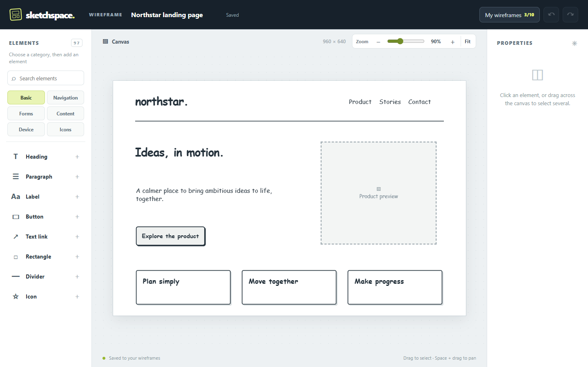
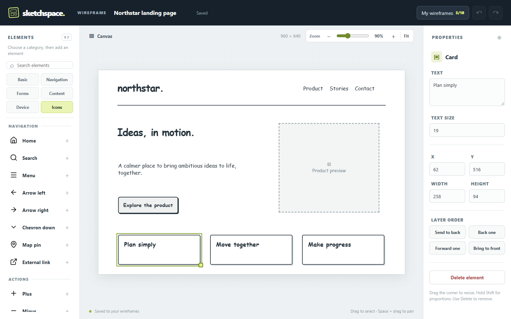
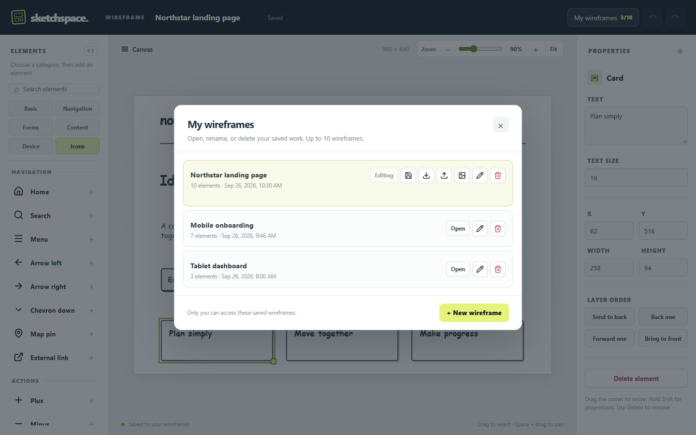

<div align="center">

# Sketchspace

### Wireframe quickly. Keep the idea moving.

A focused **Windows desktop app** for rough layouts, interface ideas and early product flows. Open it, place an element on the canvas, and keep working even when you are offline.

[Download the Windows installer](https://github.com/will-krof/sketchspace/releases/latest) · [See Cadence](https://github.com/will-krof/cadence)

<br /><br />



</div>

## Install on Windows

Download and run `Sketchspace-Setup-*.exe` from the [latest release](https://github.com/will-krof/sketchspace/releases/latest), or install with one PowerShell line:

```powershell
irm https://raw.githubusercontent.com/will-krof/sketchspace/main/scripts/install.ps1 | iex
```

The script downloads the latest installer from GitHub Releases, verifies its SHA-512 checksum, and runs it. An internet connection is needed for installation and update checks. The editor and your saved wireframes work offline. Windows may warn about an unsigned installer until code signing is configured.

## Made for the first draft

| Build | Refine | Keep |
| --- | --- | --- |
| Search **97 elements** across basics, navigation, forms, content, devices and icons. | Edit text, list entries, dropdown options and table cells. Resize, zoom and arrange layers. | Save up to **10 wireframes locally**. Rename, delete, import JSON, or export JSON and PNG. |

Sketchspace has desktop, tablet and mobile canvases, along with iPhone, Samsung and tablet frames. Its monochrome icon palette contains common interface symbols and familiar service marks.

<table>
<tr>
<td width="50%"></td>
<td width="50%"></td>
</tr>
<tr>
<td><b>Edit in place.</b> Select an element to change its content, size and layer order.</td>
<td><b>Keep your work close.</b> Your wireframes live in the app's per-user data directory on this computer.</td>
</tr>
</table>

The screenshots use fictional demo wireframes.

## Updates and local data

The installed app checks GitHub Releases at startup and every 30 minutes while it is open. When a newer version is published, an **Update** button appears in the top bar. Click it to download the update, then click **Restart to update**. Update checks require internet access; an offline check does not interrupt editing.

Each push to `main` runs the Windows release workflow. It builds and tests the app, gives it a new version, publishes a GitHub Release with the installer and update metadata, and makes that release available to installed copies. A failed workflow does not publish an update.

Wireframes are saved to a local JSON file in Electron's `userData` directory. They are not uploaded to GitHub or synchronized between computers. To move work from the earlier web editor, export each wireframe as JSON there and import it through **My wireframes** in the desktop app.

## A quick workflow

1. Pick an element category or search the palette.
2. Click an element to add it to the canvas; drag and resize it.
3. Use the properties panel to edit content, text size and layer order.
4. Open **My wireframes** to organize saved work or export the result.

| Gesture | Result |
| --- | --- |
| Drag across empty canvas | Select several elements |
| Shift + click | Add or remove an element from selection |
| Shift + resize | Keep the element's proportions |
| Space + drag | Pan the canvas |
| Delete / Backspace | Remove selected elements |
| Ctrl + Z | Undo; add Shift to redo |
| Arrow keys | Nudge selection; add Shift for a larger step |

## Build from source

Use Node.js 24 or newer and pnpm 11. On Windows:

```powershell
pnpm install
pnpm build
pnpm test
pnpm desktop:dev
```

Build a local installer with `pnpm desktop:dist`; the output goes to `release/`. The updater is active in packaged builds. The existing `pnpm build` command also builds the legacy hosted Worker; the desktop app uses the same editor assets and its own local storage bridge.

| Path | Purpose |
| --- | --- |
| `dist/` | Shared editor UI, styles and icons |
| `desktop/` | Secure Electron shell, local storage and update bridge |
| `assets/` | Windows app icon |
| `scripts/install.ps1` | One-line installer helper |
| `.github/workflows/windows-release.yml` | Build and publish Windows releases |
| `worker/`, `db/`, `drizzle/` | Earlier hosted storage backend |

<div align="center"><sub>Sketchspace and <a href="https://github.com/will-krof/cadence">Cadence</a> share a visual language: navy chrome, quiet surfaces and lime accents.</sub></div>
